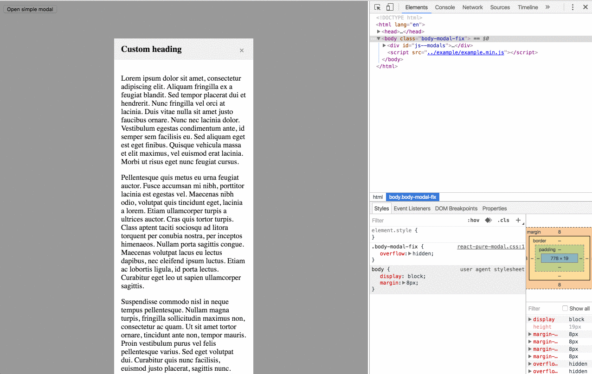
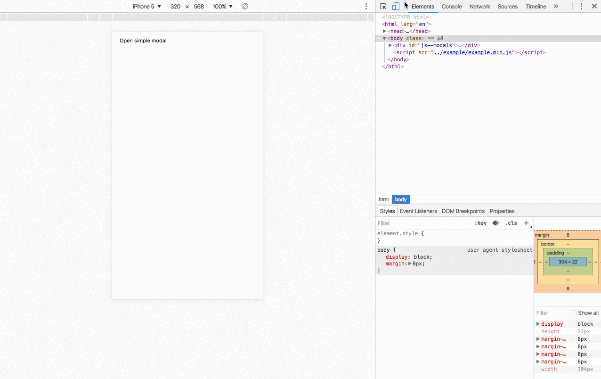

# react-pure-modal [](https://www.npmjs.org/package/react-pure-modal) [](https://travis-ci.org/memCrab/react-pure-modal) [](https://david-dm.org/memCrab/react-pure-modal)
[](https://nodei.co/npm/react-pure-modal/)

React pure modal is a simplest way to create dialog on your site.
- Very small (less than 4Kb)
- Mobile friendly
- Without dependencies

## Screencast
### Simple

### With inner scrolling


## Installation
`npm i -S react-pure-modal`

## Usage
```jsx
import PureModal from 'react-pure-modal';
import 'react-pure-modal/dist/react-pure-modal.min.css';

<PureModal
  header="Your header"
  footer={<div><button>Cancel</button><button>Save</button></div>}
  onClose={() => {
    console.log('handle closing');
    return true;
  }}
  isOpen
  ref="modal"
>
  <p>Your content</p>
</PureModal>
```

And open with

`<button onClick={() => this.refs.modal.open() }>Open modal</button>`

## Options

#### replace `PropTypes.bool` (default: false)
Replace all inner markup with Component children
#### isOpen: `PropTypes.bool`
Control modal state from parent component
#### scrollable: `PropTypes.bool` (default: true)
You can disable scroll in modal body
#### draggable: `PropTypes.bool` (default: false)
You can drag a modal window
#### onClose: `PropTypes.func`
Handle modal closing. Should return true if you allow closing
#### className: `PropTypes.string`
ClassName for modal DOM element, can be used for set modal width or change behaviour on mobile devices
#### width: `PropTypes.string` (example '200px')
Width in pixels, em's, vw etc
#### header: `PropTypes.oneOfType([ PropTypes.node, PropTypes.string ])`
Modal heading, doesn't disabled close button
#### footer: `PropTypes.oneOfType([ PropTypes.node, PropTypes.string ])`
Place here your actions


## Changelog (latest on top)
   - Drag and drop
   - fix bug in firefox and safari with modal position
   - set width as atribute
   - new default aligning to the screen center!
   - prevent of modal closing if ESC pressed in editable element
   - now with minified css!
   - styles are more impressive now, good mobile support
   - now scrollable can be false
   - remove dependencies, rewrite open and close logic, fix linting
   - new header logic and breaking classes changes

## Developing
   - `npm install`
   - `npm run webpack:dev -- --watch`
   - `npm run webpack:prod -- --watch`
   - `npm run test:dev`
   - Open `index.html` from examples
